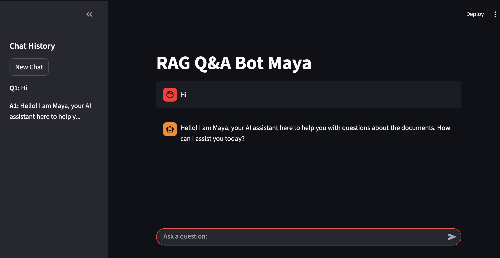

# Building a RAG Q&A Bot with LangChain, Ollama, and FAISS



## Introduction

In this technical deep dive, we'll explore the implementation of a Retrieval-Augmented Generation (RAG) Q&A bot using modern AI frameworks. This project leverages LangChain for orchestration, Ollama for local LLM inference, and FAISS for efficient vector similarity search to create a robust document-based question-answering system.

## Architecture Overview

The application follows a modular architecture with clear separation of concerns:

```
myrag/
├── src/
│   ├── utils.py          # Environment variable management
│   ├── data_loader.py    # PDF document loading and text splitting
│   ├── vector_store.py   # Vector database operations
│   └── __init__.py
├── app/
│   ├── ui.py             # Streamlit web interface
│   └── app.py            # FastAPI REST API
├── data/                 # PDF document storage
├── db/                   # FAISS vector store persistence
└── requirements.txt      # Python dependencies
```

## Core Components

### 1. Data Ingestion Pipeline

The data loading pipeline utilizes LangChain's `PyPDFLoader` to extract text from PDF documents:

```python
from langchain.document_loaders import PyPDFLoader

def load_and_split_pdfs(data_dir="./data"):
    documents = []
    for pdf_file in os.listdir(data_dir):
        if pdf_file.endswith('.pdf'):
            loader = PyPDFLoader(os.path.join(data_dir, pdf_file))
            documents.extend(loader.load())
    return documents
```

Documents are then chunked using `RecursiveCharacterTextSplitter` with configurable overlap to maintain context continuity:

```python
from langchain.text_splitter import RecursiveCharacterTextSplitter

text_splitter = RecursiveCharacterTextSplitter(
    chunk_size=1000,
    chunk_overlap=200
)
chunks = text_splitter.split_documents(documents)
```
### TO recreate the vector database 
To recreate the vector database, run the application script app/app.py. This will automatically check if the vector store exists; if not, it will load and process the PDFs from the data/ directory, create chunks, and build a new FAISS vector store, persisting it to db/vector_store/


### 2. Vector Embeddings and Storage

Text chunks are transformed into dense vector representations using Ollama's embedding models:

```python
from langchain.embeddings import OllamaEmbeddings

embeddings = OllamaEmbeddings(model="mxbai-embed-large")
```

These vectors are indexed in FAISS, a highly efficient similarity search library:

```python
from langchain.vectorstores import FAISS

vectorstore = FAISS.from_documents(chunks, embeddings)
vectorstore.save_local(persist_directory)
```

FAISS employs approximate nearest neighbor (ANN) algorithms like IVF (Inverted File) or HNSW for sub-linear time complexity retrieval.

### 3. Retrieval-Augmented Generation

The RAG pipeline combines retrieval and generation:

```python
retriever = vectorstore.as_retriever(
    search_type="similarity_score_threshold",
    search_kwargs={"k": 50, "score_threshold": 0.3}
)

chain = (
    {"context": retriever | format_docs, "question": RunnablePassthrough()}
    | prompt
    | llm
    | StrOutputParser()
)
```

This implements semantic search with score thresholding to filter low-relevance documents, reducing hallucinations in generated responses.

### 4. Metadata Filtering

Advanced filtering enhances retrieval precision:

```python
def filter_by_metadata(docs, question):
    if "leave" in question.lower():
        policy_docs = [doc for doc in docs if doc.metadata.get("type") == "policy"]
        return policy_docs[:10]
    return docs[:10]
```

This domain-specific filtering prioritizes relevant document types based on query intent.

## User Interfaces

### Streamlit Web Application

The conversational UI uses Streamlit's chat components with session state management:

```python
if "chat_history" not in st.session_state:
    st.session_state.chat_history = []

question = st.chat_input("Ask a question:")
if question:
    answer = chain.invoke({"question": question})
    st.session_state.chat_history.append((question, answer))
    st.rerun()
```

### FastAPI REST Service

The API exposes endpoints for programmatic access:

```python
from fastapi import FastAPI

app = FastAPI()

@app.post("/ask")
async def ask_question(request: QuestionRequest):
    answer = chain.invoke({"question": request.question})
    return {"answer": answer}
```

## Technical Considerations

### Performance Optimization

- **Chunk Size Tuning**: 1000 characters with 200-character overlap balances context preservation and retrieval granularity
- **Embedding Model Selection**: `mxbai-embed-large` provides superior semantic understanding compared to smaller models
- **Vector Store Configuration**: Similarity score thresholding (0.3) filters noise while maintaining recall

### Scalability

- FAISS supports distributed indexing for large document corpora
- Ollama enables local inference, reducing latency and API costs
- Modular architecture allows horizontal scaling of retrieval and generation components

### Security and Privacy

- Local model execution ensures data privacy
- No external API dependencies for core functionality
- Document access controlled through file system permissions

## Deployment

Run the application from the project root directory:

```bash
# Activate virtual environment
source .venv/bin/activate

# Launch Streamlit UI
streamlit run app/ui.py

# Or launch FastAPI server
uvicorn app.app:app --reload
```

The application automatically configures the Python path for relative imports, making it portable across different systems.

## Conclusion

This RAG implementation demonstrates the power of combining vector databases, local LLMs, and modern Python frameworks to create intelligent document Q&A systems. The modular design enables easy extension for additional data sources, advanced retrieval strategies, and multi-modal inputs.

Key takeaways:
- RAG significantly improves answer accuracy over pure generation approaches
- Local inference provides better privacy and cost characteristics
- Proper chunking and metadata utilization are crucial for retrieval quality
- Modular architecture facilitates maintenance and feature addition

The codebase serves as a solid foundation for building production-grade document intelligence applications.
